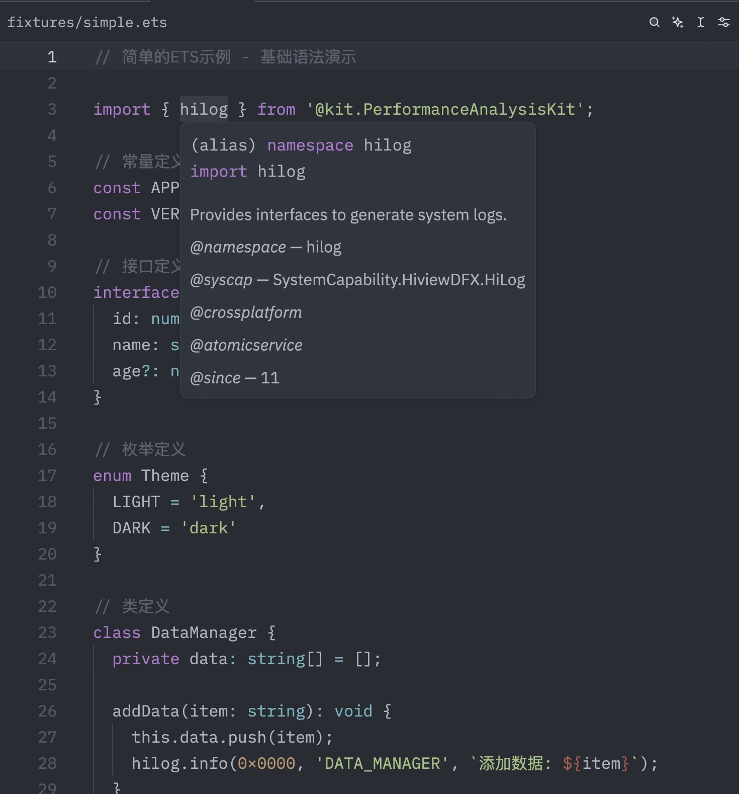

# ArkTS Extension

A Zed extension for ArkTS (aka.ETS) development support.

This project is based on [Million-mo/tree-sitter-arkts](https://github.com/Million-mo/tree-sitter-arkts) and [ohosvscode/arkTS](https://github.com/ohosvscode/arkTS). Thanks for offering an excellent foundation for ArkTS.

## Features

- **Syntax Highlighting**: Provides TypeScript-based syntax highlighting for ETS files
- **Language Server**: Provides basic language server support, such as go to definition, and find references.




## Current Status

This is a **Zed language extension** that provides:

- File type detection (`.ets` → ETS language)
- Syntax highlighting extending TypeScript grammar
- Go to definition
- Find references
- Module definition

## Plans
- Compatible with more Node.js versions.
- Autocomplete.
- JSON5 schemas support for `oh-package.json5`.
- Code actions, like formatting.

## Non-goals
- Debuggers.
- Code snippets.
- OpenHarmony SDK management.

## Installation

### From Source

You need a Node.js environment to build this extension. Prefer Node.js 24 currently.

1. Clone this repository
2. Open extension page in Zed and install extension from directory

## Configuration

All you need is to put language server settings in zed's `settings.json`:

```json5
{
  "lsp": {
    "arkts-language-server": {
      "initialization_options": {
        "tsdk": "/path/to/typescript/lib",
        "ohosSdkPath": "/path/to/OpenHarmony/xx"
      }
    }
  }
}
```

- `tsdk`: Path to typescript declarations.
- `ohosSdkPath` Path to certain Harmony SDK.

## Development

```bash
# Build in development mode
cargo build

# Build for release
cargo build --release

# Use the build script
./build.sh
```

## Testing

This project includes comprehensive **fully automated** testing for the LSP implementation.

### Full E2E Automation (完全自动化)

```bash
# Complete end-to-end automated test (no manual steps!)
# 完全自动化端到端测试（无需人工操作！）
./scripts/e2e-automated-test.sh
```

This script automatically:
1. ✅ Installs Zed editor
2. ✅ Installs OpenHarmony SDK (mock version)
3. ✅ Builds and installs the extension
4. ✅ **Verifies Zed-LSP integration** (real Zed CLI if available, simulation otherwise)
5. ✅ Runs automated LSP tests
6. ✅ Validates results programmatically

### Testing with Real Zed (真实 Zed 测试)

**NEW**: Test with actual Zed CLI and log analysis!

```bash
# Test using real Zed editor (if installed)
# 使用真实 Zed 编辑器测试（如果已安装）
./scripts/test-zed-real.sh

# This script:
# - Launches actual Zed with test files
# - Monitors Zed's log files in real-time
# - Detects extension loading and LSP startup
# - Extracts LSP messages from logs
# - Falls back to simulation if Zed unavailable
```

See `docs/ZED_CLI_TESTING.md` for detailed documentation on Zed CLI testing approaches.

### Individual Automation Scripts

```bash
# Install Zed automatically
./scripts/auto-install-zed.sh

# Install extension automatically
./scripts/auto-install-local-extension.sh

# Install OpenHarmony SDK (mock for testing)
./scripts/install-mock-ohos-sdk.sh

# Test with real Zed CLI (NEW!)
./scripts/test-zed-real.sh

# Test Zed-LSP integration (simulation)
./scripts/test-zed-integration.sh

# Run automated LSP tests (no GUI required)
./scripts/test-lsp-automated.sh
```

### Unit & Integration Tests

```bash
# Run all unit tests
cd zed-ets-language-server
npm test

# Run integration tests
npm run test:integration

# Run with coverage
npm run test -- --coverage
```

### Documentation

For detailed information about testing:
- [Full Automation Guide (完全自动化指南)](docs/FULL_AUTOMATION.md) ⭐ NEW
- [Testing Guide (English)](docs/TESTING_EN.md)
- [测试指南 (中文)](docs/TESTING.md)

### Sample Project

A sample ArkTS project is provided in `test-fixtures/arkts-sample-project/` for manual and automated testing. See [Sample Project README](test-fixtures/arkts-sample-project/README.md) for details.

## License

MIT License - see LICENSE file for details
