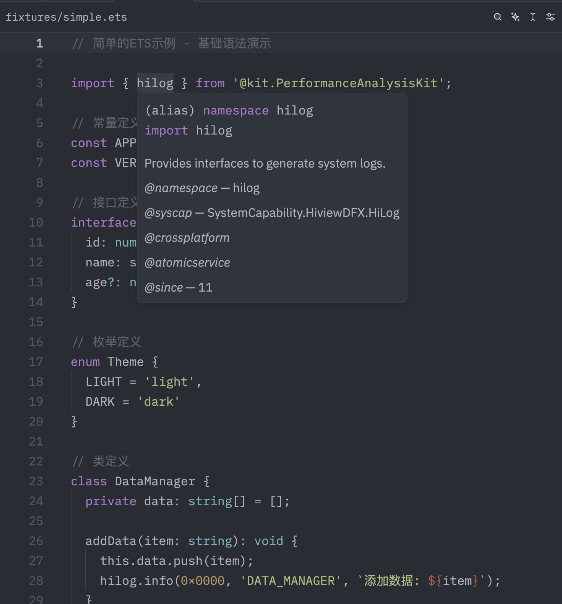

# ArkTS Extension

A Zed extension for ArkTS (aka.ETS) development support.

This project is based on [Million-mo/tree-sitter-arkts](https://github.com/Million-mo/tree-sitter-arkts) and [ohosvscode/arkTS](https://github.com/ohosvscode/arkTS). Thanks for offering an excellent foundation for ArkTS.

## Features

- **Syntax Highlighting**: Provides TypeScript-based syntax highlighting for ETS files
- **Language Server**: Provides basic language server support, such as go to definition, and find references.
- **HarmonyOS SDK types**: Resolves OpenHarmony and HMS `@kit.*` declarations from an installed DevEco Studio SDK.




## Current Status

This is a **Zed language extension** that provides:

- File type detection (`.ets` → ETS language)
- Syntax highlighting extending TypeScript grammar
- Go to definition
- Find references
- Module definition
- Code formatting support (via Language Server or external tools)

## Plans
- Compatible with more Node.js versions.
- Autocomplete.
- JSON5 schemas support for `oh-package.json5`.

## Non-goals
- Debuggers.
- Code snippets.
- Installing or updating HarmonyOS SDKs.

## Installation

### From Source

You need a Node.js environment to build this extension. Prefer Node.js 24 currently.

1. Clone this repository
2. Open extension page in Zed and install extension from directory

## Configuration

The extension automatically detects the SDK bundled with DevEco Studio in its
standard installation location and the macOS user SDK directories under
`~/Library/OpenHarmony/Sdk` and `~/Library/Huawei/Sdk`. It also checks versioned
SDK directories and uses the newest installed version when no `default` SDK is
available.

Explicit settings take precedence over environment variables and automatic
detection. Use the following configuration only when DevEco Studio or its SDK
is installed in a custom location:

```json5
{
  "lsp": {
    "arkts-language-server": {
      "initialization_options": {
        "ohosSdkPath": "/path/to/sdk/default/openharmony",
        "hmsSdkPath": "/path/to/sdk/default/hms"
      }
    }
  }
}
```

- `ohosSdkPath`: OpenHarmony SDK root containing `ets/api`, `ets/kits`, and
  `ets/build-tools/ets-loader/tsconfig.json`.
- `hmsSdkPath`: Optional HMS SDK root. When omitted, a sibling `hms` directory
  is detected automatically.
- `tsdk`: Optional TypeScript declarations directory. The wrapper normally
  detects the `ohos-typescript` installation automatically.

The corresponding environment variables are `ZED_ETS_OHOS_SDK_PATH`,
`OHOS_SDK_PATH`, `HARMONYOS_SDK_HOME`, `OPENHARMONY_SDK_HOME`,
`DEVECO_SDK_HOME`, `DEVECO_STUDIO_HOME`, `DEVECO_HOME`,
`ZED_ETS_HMS_SDK_PATH`, and `HMS_SDK_PATH`.

If imports such as `@kit.AbilityKit` report `ts 2307`, verify that
the configured directory contains `openharmony/ets` or is the OpenHarmony SDK
root itself. Do not point it directly at the child `ets` directory. Restart the
language server after changing SDK settings.

### Code Formatting

The extension supports code formatting through the language server.

#### Using Language Server Formatting

The ArkTS language server provides built-in formatting support through the custom `ets/formatDocument` request. The extension automatically forwards standard LSP formatting requests to this custom endpoint, so no additional configuration is required. Simply use Zed's standard formatting commands (e.g., format on save or manual format).

#### Using External Formatters (e.g., Prettier)

You can configure external formatters in your `settings.json`:

```json
{
  "languages": {
    "ArkTS Language": {
      "formatter": {
        "external": {
          "command": "prettier",
          "arguments": ["--stdin-filepath", "{buffer_path}", "--parser", "typescript"]
        }
      }
    }
  }
}
```

## Development

```bash
# Build in development mode
cargo build

# Build for release
cargo build --release
```

## Testing

This project includes comprehensive **fully automated** testing for the LSP implementation.

### Full E2E Automation (完全自动化)

```bash
# Complete end-to-end automated test (no manual steps!)
# 完全自动化端到端测试（无需人工操作！）
./scripts/e2e-automated-test.sh
```

This script automatically:
1. ✅ Installs Zed editor
2. ✅ Installs OpenHarmony SDK (mock version)
3. ✅ Builds and installs the extension
4. ✅ **Verifies Zed-LSP integration using real Zed CLI**
5. ✅ Runs automated LSP tests
6. ✅ Validates results programmatically

### Testing with Real Zed (真实 Zed 测试)

**Test with actual Zed CLI and log analysis!**

```bash
# Test using real Zed editor
# 使用真实 Zed 编辑器测试
./scripts/test-zed-real.sh

# This script:
# - Launches actual Zed with test files
# - Monitors Zed's log files in real-time
# - Detects extension loading and LSP startup
# - Extracts LSP messages from logs
# - Requires Zed to be installed
```

### Individual Automation Scripts

```bash
# Install Zed automatically
./scripts/auto-install-zed.sh

# Install extension automatically
./scripts/auto-install-local-extension.sh

# Install OpenHarmony SDK (mock for testing)
./scripts/install-mock-ohos-sdk.sh

# Test with real Zed CLI
./scripts/test-zed-real.sh

# Run automated LSP tests (no GUI required)
./scripts/test-lsp-automated.sh
```

### Code Formatting Tests

The project includes comprehensive automated tests for the code formatting functionality with **actual content validation**:

```bash
# Run formatting tests only
cd zed-ets-language-server
npm run test:formatting
```

The formatting tests verify:
- ✅ **Actual formatting results**: Validates that unformatted code becomes properly formatted
- ✅ **TextEdit application**: Verifies that formatting edits produce expected output
- ✅ Standard LSP formatting requests are forwarded to `ets/formatDocument`
- ✅ Range formatting requests are properly handled
- ✅ Formatting options (tab size, spaces vs tabs) are preserved and applied correctly
- ✅ Multiple sequential formatting requests work correctly
- ✅ Formatted code is syntactically valid with proper indentation
- ✅ Edge cases and various formatting configurations

**Test Suite**: 24 comprehensive test cases including:
- Content validation tests that check actual formatted output
- LSP protocol forwarding tests
- TextEdit structure and application tests

### Unit & Integration Tests

```bash
# Run all unit tests
cd zed-ets-language-server
npm test

# Run integration tests
npm run test:integration

# Run with coverage
npm run test -- --coverage
```

### Documentation

For detailed information about the automated testing design:
- [Automation Design (自动化设计)](docs/AUTOMATION_DESIGN.md) - High-level design overview

### Sample Project

A sample ArkTS project is provided in `test-fixtures/arkts-sample-project/` for testing. See [Sample Project README](test-fixtures/arkts-sample-project/README.md) for details.

## License

MIT License - see LICENSE file for details
